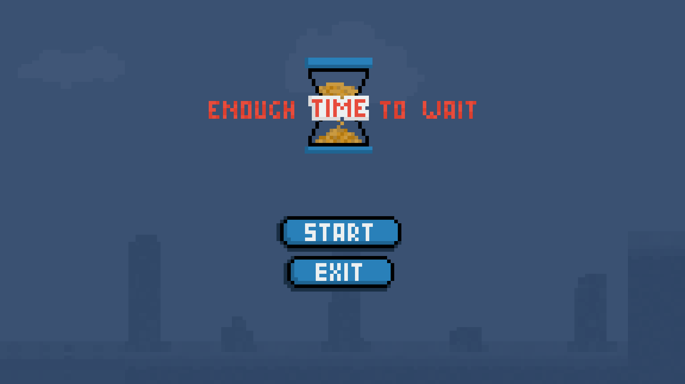
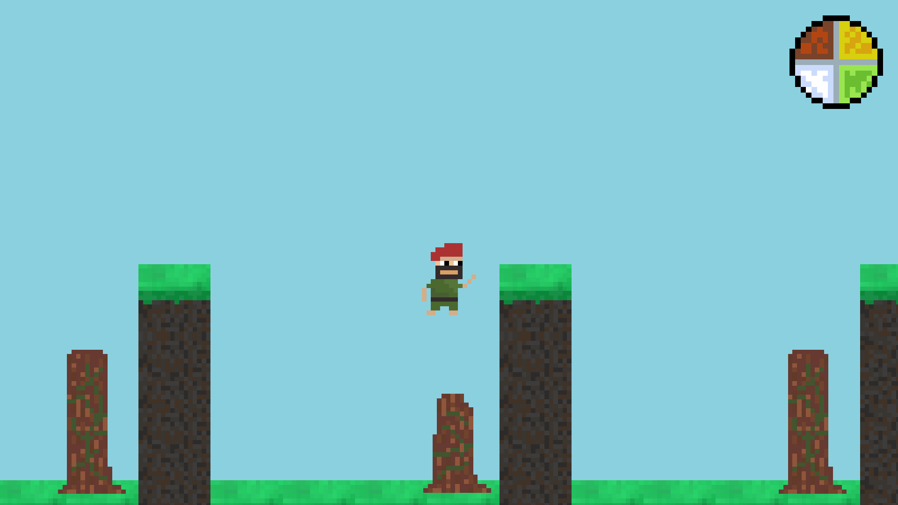

# Enough Time to Wait

Welcome to "Enough Time to Wait" - a captivating puzzle game where time is your most valuable resource. In this game, you'll embark on a journey to solve puzzles by rewinding time. Use your temporal abilities to navigate through challenges and overcome obstacles.

## Table of Contents

- [Introduction](#introduction)
- [Features](#features)
- [Installation](#installation)
- [How to Play](#how-to-play)
- [Controls](#controls)
- [Screenshots](#screenshots)
- [Contributing](#contributing)
- [License](#license)

## Introduction

"Enough Time to Wait" is a unique puzzle game that challenges your problem-solving skills and creativity. With the ability to rewind time, you'll need to think critically to unravel the mysteries that lie ahead. Each level presents a new set of challenges, and only those with a keen sense of time manipulation will emerge victorious.

## Features

- **Time Rewind Mechanic:** Rewind time to explore different outcomes and find the best solutions to puzzles.
- **Engaging Puzzles:** Encounter a variety of puzzles that will test your logic, memory, and strategic thinking.
- **Immersive Environment:** Dive into a visually stunning world designed to enhance your gaming experience.
- **Progressive Difficulty:** Start with simple puzzles and gradually face more complex challenges as you advance through the game.

## Installation

To get started with "Enough Time to Wait":

You can just download last version of this game in releases tab.

## How to Play

1. Start the game and select a level.
2. Use the time rewind mechanic to navigate through obstacles and solve puzzles.
3. Experiment with different approaches and observe the outcomes.
4. Reach the goal by manipulating time and solving challenges.

## Controls

- **AD keys:** Move character
- **R key:** Rewind time
- **Space bar:** Jump
- **Shift key** Crouchc

## Screenshots

*Menu*

*Gameplay*

## Contributing

Contributions are welcome! If you have ideas for new features, encounter bugs, or want to improve the game in any way, please open an issue or submit a pull request.

## License

This project is licensed under the [MIT License](LICENSE.md).

Enjoy playing "Enough Time to Wait"! Feel free to share your feedback and have fun rewinding time to solve puzzles.
